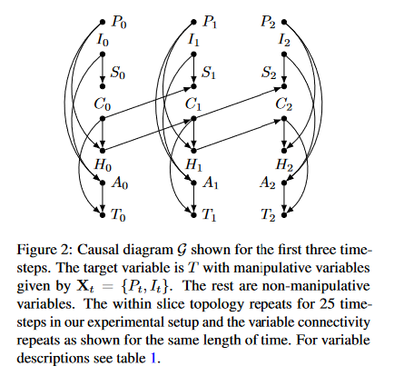
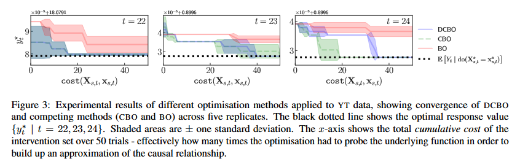

# Developing Optimal Causal Cyber-Defence Agents via Cyber Security Simulation

This repository holds code for getting the experiment running as defined in the paper [Developing Optimal Causal Cyber-Defence Agents via Cyber-Security Simulation](https://www.researchgate.net/publication/362252214_Developing_Optimal_Causal_Cyber-Defence_Agents_via_Cyber_Security_Simulation)

## Abstract

In this paper we explore cyber security defence, through the unification of a novel cyber security simulator with models for (causal) decision-making through optimisation. Particular attention is paid to a recently published approach: dynamic causal Bayesian optimisation (DCBO). We propose that DCBO can act as a blue agent when provided with a view of a simulated network and a causal model of how a red agent spreads within that network. To investigate how DCBO can perform optimal interventions on host nodes, in order to reduce the cost of intrusions caused by the red agent. Through this we demonstrate a complete cyber-simulation system, which we use to generate observational data for DCBO and provide numerical quantitative results which lay the foundations for future work in this space.

<p align="center" width="100%">
    
    
</p>

<embed src="ICML_ML4Cyber_Poster.pdf" type="application/pdf"/>

## Installation

Use conda to create the environment from the `environment.yml` file:
```bash
conda env create -f environment.yml
```
Clone DCBO and YAWNING TITAN to the working directory:

```bash
cd ..
git clone https://github.com/neildhir/DCBO.git
git clone https://github.com/dstl/YAWNING-TITAN.git
cd causal-cyber-defence
```
Run through the `Example.ipynb` notebook!

## Citation

Please cite the ML4Cyber Workshop paper if you reference this work:
```
@inproceedings{inproceedings,
 author = {Andrew, Alex and Spillard, Sam and Collyer, Joshua and Dhir, Neil},
 year = {2022},
 month = {07},
 pages = {},
 title = {Developing Optimal Causal Cyber-Defence Agents via Cyber Security Simulation},
 maintitle = {International Confernece on Machine Learning (ICML)},
 booktitle = {Workshop on Machine Learning for Cybersecurity (ML4Cyber)}
}
```